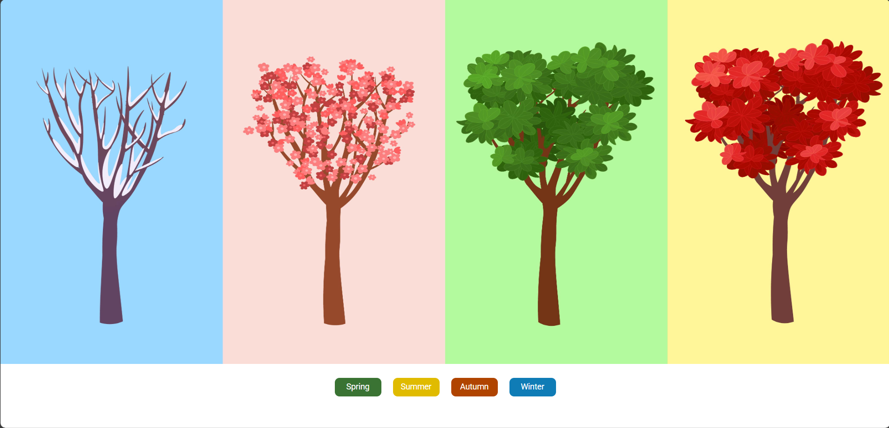

# 🌤️ Seasons Switcher

A responsive web mini project that dynamically updates seasonal visuals for **Spring**, **Summer**, **Autumn**, and **Winter** based on user interaction. Built using **HTML**, **CSS**, **JavaScript**, and **Bootstrap**.

---

## 🚀 Live Demo

👉 [Live Project on GitHub Pages](https://praveenkumarkota-dev.github.io/seasons-switcher/)  
👉 [View Source Code](https://github.com/praveenkumarkota-dev/seasons-switcher)

---

## 🎯 Features

- ✅ Fully responsive for small and medium screens
- 🔄 Dynamic image switching with `onclick` buttons
- 📱 Mobile-optimized using Bootstrap visibility classes
- 🎨 Clean UI and season-specific color palette

---

## 🧰 Tech Stack

- HTML5
- CSS3
- Bootstrap 4.5
- JavaScript (Vanilla)

---

## 🧠 What I Learned

- DOM manipulation with JavaScript
- Responsive image handling using Bootstrap utility classes
- Structuring interactive UI for better UX

---

## 📸 Preview

---

## 📁 Folder Structure

seasons-switcher/
├── index.html
├── styles.css
├── script.js
├── assets/
│ └── seasons-switcher-screenshot.p

---

## 📬 Contact

- 🔗 [LinkedIn](https://www.linkedin.com/in/praveen-kumar-kota/)
- 📧 Email: praveenkumarkota.fsd@gmail.com (or your preferred email)

---

## 🙌 Acknowledgements

This project was created as part of my learning at **NxtWave CCBP 4.0**.

---

⭐️ **If you like it, please give the repo a star and share your feedback!**
